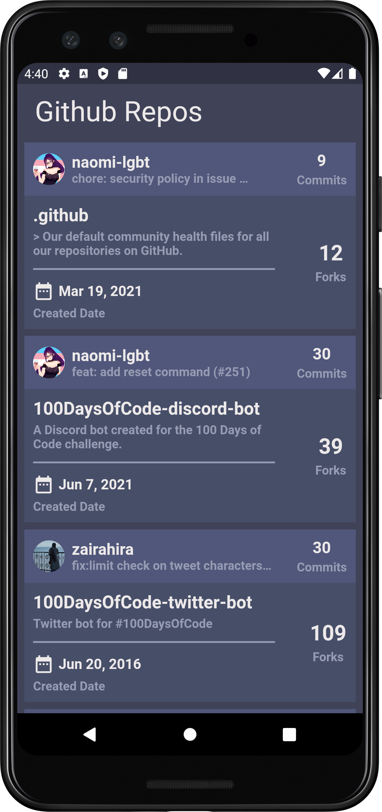

# Github Repo

This is a Flutter app that I built. It uses github repo APIs to fill UI.

## Screenshots

Here is a screenshot of the app:

## Getting Started

To run this app, you will need the Flutter SDK.

1. [Install Flutter](https://flutter.dev/docs/get-started/install)
2. Clone this repository
3. Navigate to the project directory in your terminal
4. Run `flutter run` to start the app

## Credits

- [Flutter](https://flutter.dev)
- [Dart](https://dart.dev)
